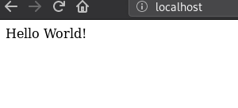
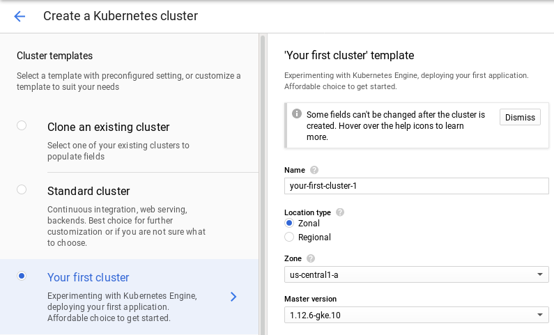

# Learning k8s

This repo is my notes and interpretation of how to get a project up and running
on kubernetes in google cloud, and should serve as a reference to myself.

More conceptual stuff to give a better understanding of kubernetes is provided
in the [on kubernetes](./on_kubernetes.md) document.

## App

The repo contains a simple webapp in the app directory.  This webapp is
dockerized. `cd` into the app dir and build the docker container using the 
following command:

`$ docker build -t eu.gcr.io/<myproject>/k8s_tests/hello_k8s:latest .`

Run the docker container:

`$ docker run -p 80:8000 --rm eu.gcr.io/<myproject>/k8s_tests/hello_k8s:latest`

Then go to localhost and you should see hello world served from the container

Before moving on we must push the created image to the google container
registry:

`$ gcloud auth configure-docker # Akin to docker login`
`$ docker push eu.gcr.io/<myproject>/k8s_tests/hello_k8s:latest`

I have already done this, and have this test image publically available for the
tutorial

## Running on minikube

Requires that you have installed minikube and kubectl locally. Also requires virtualization drivers.  See the tutorials on [kubernetes](https://kubernetes.io/docs/setup/minikube/#quickstart) on this.
1. Start minikube: `$ minikube start -p mycluster`
2. Check kubectl context  `$ kubectl config current-context` -> Should output "mycluster"

Now you have a local cluster to play with.  To deploy the hello world app to the cluster with an appropriate service:

3. Deployment: `$ kubectl apply -f my_deployement.yaml`
4. Service: `$ kubectl apply -f my_service.yaml`
5. Get the node ip: `$ minikube ip -p mycluster`
6. Get the node port (which maps to the service): `kubectl get services
   my-service`
7. Visit the service in your browser on `<Node IP>:<NodePort>`

These lasts steps can also be used on a production cluster to deploy our app,
except in production we would use an ingress or loadbalancer service rather
than a NodePort.

## K8s cluster on gcloud

Google Kuberenetes Engine (GKE) is the managed Kubernetes solution by google, which
we will be using to deploy our app. For my purposes it is well enough for
production grade projects.

Prereqs here as gcloud SDK with the kubectl component.

*First we create a cluster:*

This can be done through the gcloud console.  For this tut we are creating the
"my first cluster" cluster template provided by google. Creating cluster is
found under `Kubernetes engine -> Create Cluster`

*Connecting to cluster*

To connect to cluster, we can view our cluster in Kubernetes engine, and click
`connect`. Gcloud then gives ut a command to run locally to get access to the
cluster with kubectl:

`$ gcloud container clusters get-credentials <cluster> --zone
<zone> --project <project>`

From that point we have full access with kubectl:

`$ kubectl config current-context`

### Deploy the app

1. We can use the same deployment as earlier: `$ kubectl apply -f
   my_deployment.yaml`
2. Use the cloud service to get a connection to the service. Since we're
   using GCP, we want the deployment to be behind an external load balancer.
   This is defined in the service. `$ kubectl apply -f my_service_cloud.yaml`
3. The load balancer IP should then route us to our hello world application.
   Set up a static IP and register it with your DNS registrar, and boom - you
   should have a scalable app deployment on kubernetes!
